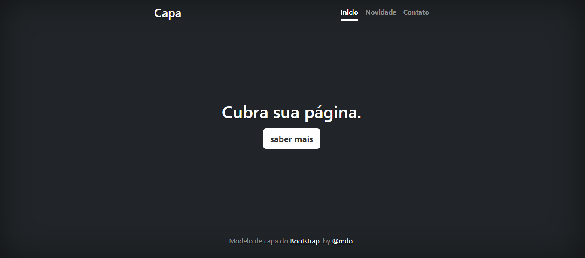

# Índice

[projeto - Aprendendo a escrever um README](#projeto---aprendendo-escrever-um-readme)
[Descrição](#descri%C3%A7%C3%A3o)  
[Itrodução](#introdu%C3%A7%C3%A3o)  
[Funcionalidades](#funcionalidades)  
[Tecnologicas Utilizadas](#tecnologias-utilizadas)  
[Fontes Consultadas](#fonte-consultadas)  
[Autores](#autores)  

# Projeto - Aprendendo a escrever um README

## Descrição
Nós, da empresa GUNA, desenvolvemos um modelo de capa para você desenvolver ou desenvolvedora usar toda sua criatividade, um modelo voce ja tem, agora basta voce criar oque voce quiser! 

## Introdução

## Funcionalidades
Este site tem funcionalidades de ajudar um desenevolvedor ou uma desenvolvedora a dar seus primeiros passos com um site, demos aquele empurrãozinho😉

### Tecnologias utilizadas

Ás tecnologias utilizadas para este modelo de capa são: CSS, JAVASCRIPT.
## Fonte consultadas
Com a ajuda do site "BOOTSTRAP" conseguimos diversas fontes que nos ajudam.

## Autores